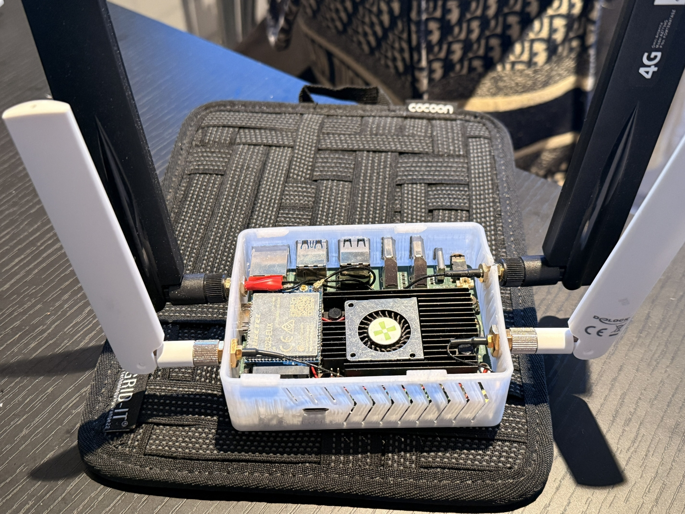
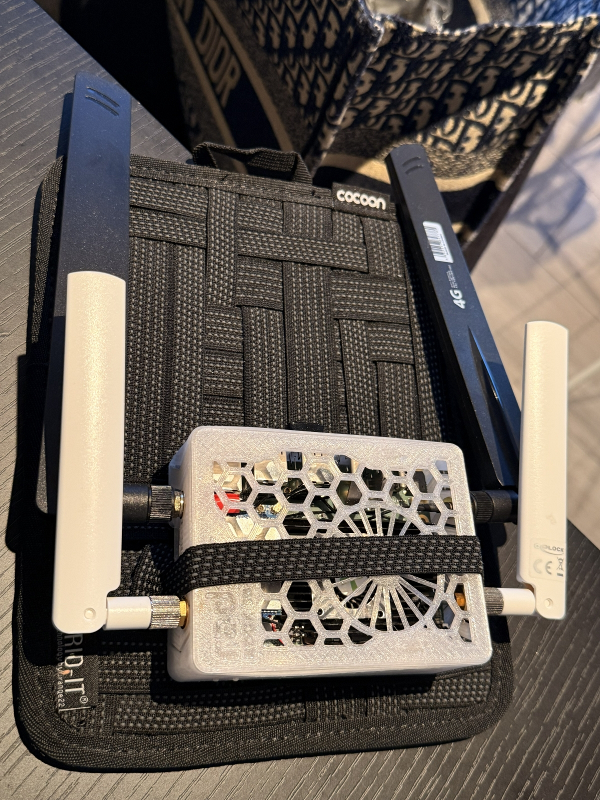
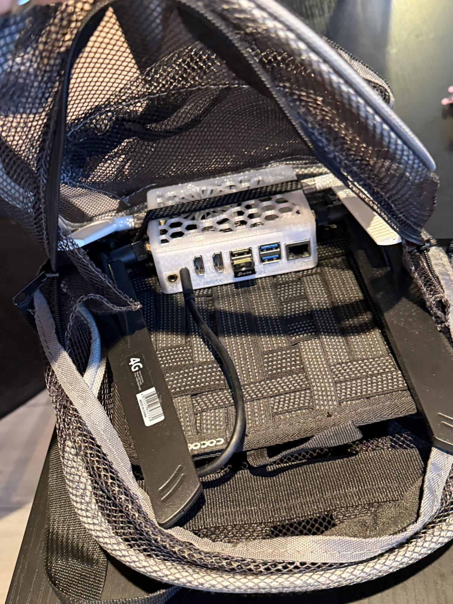

# IRL Streaming Rig — Radxa Rock 5B+ / BELABOX / DJI Pocket 4

A fully wireless-camera IRL streaming rig: a Radxa Rock 5B+ running BELABOX, with a DJI Pocket 4 sending video over WiFi instead of a cable.

Most IRL rigs run a cable from the camera to the encoder. This one doesn't — the Pocket 4 is completely untethered from the bag, so you can hand it to someone, mount it, or walk away from the backpack.

Used live on [twitch.tv/Caxyhh](https://twitch.tv/Caxyhh).


---

## Parts list

### Encoder

| Part | Notes |
|---|---|
| [Radxa Rock 5B+ (16GB)](https://radxa.com/products/rock5/5bp/) | 8GB works too |
| [Active heatsink / fan](https://www.aliexpress.com/item/1005007715615313.html) | NOT optional, though you can choose another cooler |
| [3D printed case](https://cults3d.com/en/3d-model/gadget/radxa-rock-5b) | I drilled antenna holes in the sides — two per side, four total |
| Power bank, 25,000 mAh / 140W USB-C PD | ~16 hours on a full charge. The board is sensitive to underpowering |
| USB-C cable rated for 100W+ (5A, e-marked) | Power bank → board. A cheap cable that can't carry the wattage looks exactly like a board problem |
| Small USB fan | Aimed at the Pocket 4 — see notes on overheating |
| [Backpack](https://www.amazon.com/dp/B0938YWPBD?th=1) | Summit Ridge Mini 11 Inch Mesh — anything with room for the board, power bank and cable runs |
| [Gear organizer](https://www.cocooninnovations.com/product_info.php?cat_id=61&product_id=215) | Cocoon GRID-IT — the board straps to this, then the whole panel goes in the bag |


### Camera & audio

| Part | Notes |
|---|---|
| [DJI Pocket 4](https://www.dji.com/osmo-pocket-4) | Connects over its own WiFi hotspot |
| DJI Pocket 4 battery handle | Doubles as a USB-C hub. Batteries hot-swap mid-stream without dropping the camera feed |
| Spare handle battery | One battery lasts ~2.5–3 hours of streaming. Two on rotation — swap, put the empty one on charge — keeps you going all day |
| [DJI Mic 3 (TX + RX)](https://www.dji.com/mic-3) | See notes on the receiver below |

### Antennas & modem

| Part | Notes |
|---|---|
| SIM card(s) | Separate carriers if you want redundancy |
| Upgraded WiFi antennas | I use Delock 802.11 ac/a/b/g/n RP-SMA male 2–5 dBi. Any RP-SMA antenna works — it's the pigtail below that has to match the board |
| Antenna pigtail | Delock RP-SMA female panel-mount to I-PEX MHF4 female 0.81. The Rock 5B+ WiFi module uses **I-PEX MHF4** connectors, so this is what gets the signal from the board out to a panel-mounted antenna |
| [USB WiFi dongle](https://www.tp-link.com/us/home-networking/usb-adapter/archer-t2u-nano/) | TP-Link Archer T2U Nano — second radio, dedicated to the Pocket 4 hotspot |
| [Quectel EC25-EUX M.2 LTE Cat 4 w/ antennas](https://www.aliexpress.com/item/1005011702787046.html) | With SIM slot. **EUX is the Europe variant** — pick the one that matches your region and carrier bands |

You can go for 5G modules instead, but they cost a good deal more and draw more power. 4G has been enough for my use.


### Server side

This is my self-hosted setup — the SLS part only applies if you run your own receiver. If you use [BELABOX Cloud](https://belabox.net/cloud) instead (see [Receiver side](#receiver-side) below), you just need OBS.

| Component | Notes |
|---|---|
| Ubuntu server running SRT Live Server (SLS) | Receives SRT, republishes to OBS |
| OBS | Scenes and overlays |
| [Stream-Control](https://github.com/kimsec/Stream-Control) | OBS scene switching, restream management, bitrate automation, raid auto-stop etc. |
| [Unified-Chat](https://github.com/kimsec/unified-chat) | Twitch / YouTube / Kick chat in one place with moderation |

---

## What I stream at

| Setting | Value |
|---|---|
| Resolution | 1920x1080 |
| Frame rate | 30 fps |
| Codec | HEVC (H.265), Main profile, 8-bit |
| Bitrate | 5500 kbps |
| SRT latency | 2000 ms |

BELABOX recommends 1500–2500ms SRT latency. Lower than that and you get more glitching and a lower sustainable bitrate.

---
## Two WiFi radios

You need two WiFi radios: one for the Pocket 4, one for WiFi offloading.

The Pocket 4 connects to its own hotspot, ideally on 5GHz. If that occupies your only radio, the board can't connect to any other network — which means no WiFi offloading. When you're at home or somewhere with decent WiFi, you want the stream going out over that instead of mobile data, and when you walk out of range the switch to LTE should happen seamlessly without dropping the stream.

- **USB dongle** → Pocket 4 hotspot
- **On-board WiFi** → home/venue network for uplink
- **LTE modem** → takes over when WiFi drops

---

## Setup

1. Flash BELABOX to the onboard eMMC: grab the **installer** image for the Rock 5B+ from [belabox.net/rk3588](https://belabox.net/rk3588/), write it to a microSD card (balenaEtcher or similar) and boot the board from it — it installs BELABOX to the eMMC. Remove the card, boot again, and complete setup in the BELABOX UI
2. Apply the HEVC patch and pipelines: **[belabox-pocket4-rtmp-hevc](https://github.com/Kimsec/belabox-pocket4-rtmp-hevc)** — install, verify and rollback instructions are all in that repo
3. Select the pipeline: **h265_pocket4_rtmp_localhost_publish_live_30fps**
4. Create a hotspot on the USB dongle (preferably 5GHz) for the Pocket 4, and leave the on-board WiFi for uplink
5. Set the Pocket 4 to publish RTMP to `rtmp://<belabox-address>:1935/publish/live` (example: rtmp://10.42.0.1:1935/publish/live)
6. Point BELABOX at your SRTLA receiver — address, port and stream ID go in the BELABOX UI under relay settings
7. Pull the SRT feed into OBS as a media source

### Receiver side

You need something to receive the SRTLA stream and hand it to OBS. Two options:

- **[BELABOX Cloud](https://belabox.net/cloud)** — hosted relay, no setup, small monthly cost. Start here if you don't want to run a server.
- **Self-hosted** — [srtla](https://github.com/BELABOX/srtla) receiver plus [SRT Live Server](https://github.com/Edward-Wu/srt-live-server). More work, more control.

I run [Stream-Control](https://github.com/kimsec/Stream-Control) on top for scene switching, restream management and bitrate automation.

---

## Remote control (optional)

I control the rig from anywhere through [Stream-Control](https://github.com/kimsec/Stream-Control): belaUI (the BELABOX web UI) is exposed on my own domain through a [Cloudflare Tunnel](https://developers.cloudflare.com/cloudflare-one/connections/connect-networks/) and embedded straight into Stream-Control's BELABOX tab — there's a demo on the Stream-Control repo.

One catch: belaUI talks to the encoder over a plain `ws://` WebSocket, and browsers block that on an HTTPS page. An nginx reverse proxy in front of belaUI fixes it by rewriting `ws://` to `wss://` in the served pages:

<details>
<summary><b>nginx config</b> — <code>/etc/nginx/sites-enabled/belabox.conf</code></summary>

```nginx
map $http_upgrade $connection_upgrade {
    default upgrade;
    ''      close;
}

server {
    listen 443 ssl http2;
    server_name belabox.example.com;

    ssl_certificate     /etc/ssl/belabox/belabox.pem;
    ssl_certificate_key /etc/ssl/belabox/belabox.key;
    ssl_protocols       TLSv1.2 TLSv1.3;

    # Rewrite text in the served HTML/JS (needed for the wss:// patch below)
    sub_filter_once     off;
    sub_filter_types    text/html text/css
                        application/javascript text/javascript
                        application/x-javascript;

    location / {
        # belaUI
        proxy_pass         http://127.0.0.1:80;

        # WebSocket headers
        proxy_http_version 1.1;
        proxy_set_header   Upgrade           $http_upgrade;
        proxy_set_header   Connection        $connection_upgrade;

        proxy_set_header   Host              $host;
        proxy_set_header   X-Real-IP         $remote_addr;
        proxy_set_header   X-Forwarded-Proto https;

        # Disable gzip from origin so sub_filter can rewrite the text
        proxy_set_header   Accept-Encoding "";

        # Only needed if you embed belaUI in an iframe (e.g. Stream-Control)
        add_header Content-Security-Policy "frame-ancestors 'self' https://*.example.com";

        # The actual ws:// -> wss:// patch
        sub_filter 'ws://' 'wss://';
    }
}
```

</details>

> **A word of caution:** exposing belaUI to the internet means anyone who finds the URL can try to log in to your encoder. Put something in front of it — [Cloudflare Access](https://developers.cloudflare.com/cloudflare-one/policies/access/), mTLS client certificates (`ssl_verify_client` in nginx), or at the very least a strong password and a non-obvious hostname. If securing internet-facing services isn't something you're comfortable with yet, no shame in that — just skip this section. belaUI works fine over plain HTTP on the local network, and [BELABOX Cloud](https://belabox.net/cloud) gives you remote control without exposing anything yourself.

---

## The rig



*Rock 5B+ with the Quectel EC25-EUX in the M.2 slot, active cooler, and all four antennas connected. I cracked one side while drilling the antenna holes — model them into the case before you print, and save yourself the trouble.*



*Closed up and strapped to the GRID-IT! organizer. The two black antennas are the LTE modem, the two white ones are WiFi.*



*How it sits in the bag. Antennas fold down, ports stay reachable, and the whole thing comes out in seconds.*

---

## Gotchas & known quirks

Things I ran into. Your mileage may vary — some of this may already be fixed on newer firmware.

- **M.2 slot and the modem.** The Rock 5B+ doesn't reliably detect the cellular modem when the card is screwed down flat. Shimming it so it sits at a slight angle fixed it for me — it makes better contact with the pins that way. This is a known issue on the 5B+, [documented on the Radxa forum](https://forum.radxa.com/t/rock-5b-problems-with-using-an-m-2-cellular-modem/24136) with the same EC25 modem. If your modem isn't showing up, try this before assuming the card is dead.
Also worth knowing: the M.2 B-key slot on the 5B+ is USB-only, so PCIe modems won't work. The EC25 is USB, so it's fine.

- **DJI Mic 3 receiver.** Using the Mic 3 transmitter wirelessly to the Pocket 4 (WITHOUT the receiver) may introduce a variable audio latency that the pipeline can't compensate for. In my case, after a small hiccup in the stream the audio would end up slightly delayed and stay that way. 
Plugging the receiver in by USB-C — either on the Pocket 4 or on the battery handle (can be done mid stream) — solved it completely for me. Sync locked, no drift. Worth trying it wireless first, though. It may have been patched since.

- **The Pocket 4 runs hot.** On long streams, in direct sun, or above ~30°C it heats up noticeably. I've rigged a small fan blowing on it, which keeps it stable. Worth planning for if you stream outdoors in summer.

- **HEVC and codec ID 12.** The Pocket 4 sends HEVC inside FLV using legacy codec ID 12, which stock GStreamer doesn't understand. That's what the patch repo above is for.   

- **Bitrate occasionally collapses.** On rare occasions, the outgoing bitrate from BELABOX drops to 600–900 kbps and stays there, even though the incoming feed from the Pocket 4 is still a healthy 6000–8000 kbps. Hitting stop and then start in the BELABOX UI clears it every time. I haven't figured out the root cause yet — if you run into this, that's the workaround. **And please contact me if you find a permanent fix for it.**

- **Soak test before you rely on it.** The patch is experimental. Run it for an hour or more and watch audio sync, bitrate behaviour, reconnects and temperature before taking it out on a real stream.

---

## Credits

Built by [Kim](https://kimsec.net) · [GitHub](https://github.com/kimsec) · [LinkedIn](https://linkedin.com/in/kim3k)

Field-tested by [Caxyhh](https://twitch.tv/Caxyhh).
